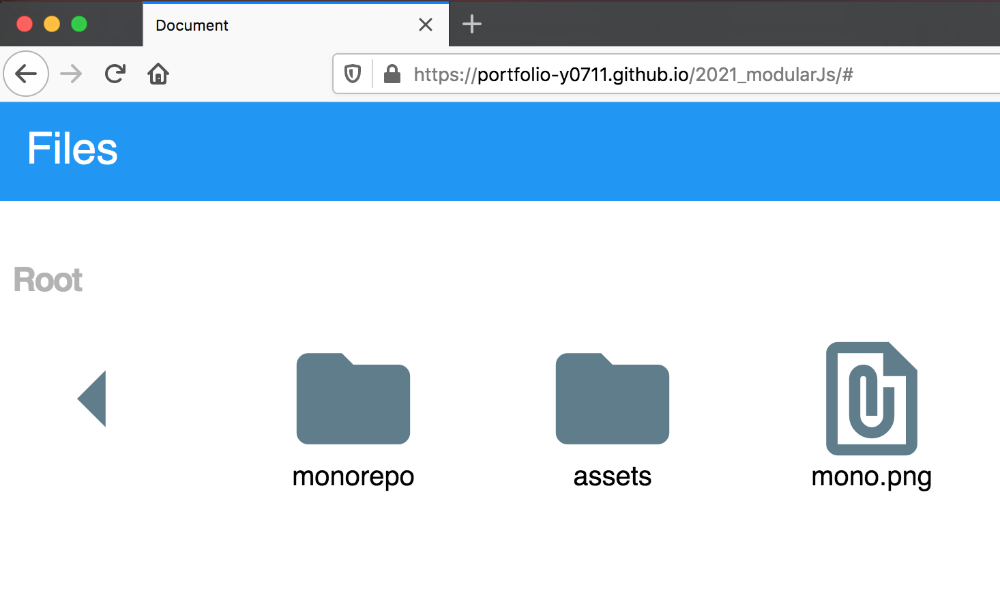

## Code Kata 2 (Pluggable Javascript) &nbsp; 

_부제: 제약 조건 하 (syntax validation, bundler, packagaging lib 없이)에서 플러그인 방식으로 개발하기_

<br/>

[완성된 페이지 보기](https://portfolio-y0711.github.io/2021_modularJs)

<br/>




목차 

* 동기 (Motivation)

* 연습 방법 (Practice Method)

    * 1단계 : 시간 제약 없이 구현하기 

    * 2단계: 시간 제약 하에서 개발하기 

* 회고 (Retrospective)

<br/>

### 1. 동기 (Motivation)

<br/>

🥅 &nbsp; **_목적_** :   

* 라이브러리 없는 개발을 통해 native 개발 환경을 이해하기 

* 주어진 기능을 최대한 빨리 구현할 수 있는 미니멀한 개발 환경 찾기 

* 현재의 요구사항의 구현에 적합한 모듈화 수준 찾기 (하드코딩 vs 모듈화)

<br/>

### 2. 연습 방법 (Practice Method)

<br/>

🥊 &nbsp; **_연습 과제_** :   

* 1단계: 시간 제약 없이 기능 개발하기 

    ```ts
    // # 특징 1) 플러그인 방식

    // 전역 컨텍스트에 IIFE로 의존성들을 관리할 App을 정의하고 
    (() => {
        window.APP = new App() 
    })()

    // 플러그인 방식으로 모듈들이 각각 아래와 같이 런타임에 주입되도록 함
    (() => {
        const app = window.APP
        if (app.appName === '2021_modular') {
            [ breadloader, finderloader, modalloader ].forEach(loader => {
                app.injectModuleLoader(loader)
            })
        }
    })()

    // # 특징 2) 프록시 어댑터 주입 

    class App {
        ...(중략)...

        start() {
            let instance

            // adaptor 객체 프로퍼티들을 병합하여 단일 프록시 객체로 생성 
            const proxy = [...this.adaptors.values()].reduce((acc, adaptor) => {
                return Object.assign(acc, { ...adaptor })
            }, {})
            const isEmpty = (proxy) => (Object.keys(proxy).length === 0 && proxy.constructor === Object)
            ;[...this.modules].forEach(([moduleName, module]) => {
                module.app = isEmpty(proxy) ? this : proxy // proxy adaptor 객체가 비어있지 않는 경우 proxy 주입 
                module.hasOwnProperty('modal') ? module.modal = this.modules.get('MODAL') : null
                const modulePrototypes = Object.getPrototypeOf(module)

                if (modulePrototypes.hasOwnProperty('componentDidMount')) {
                    module.componentDidMount()
                }
            })
        }
    }
    ...(중략)...

    ```

* 2단계: 시간 제약 하에서 개발하기 


<br/>

🚩 &nbsp; **_최종 목표_** :   

* 제한 시간 동안 아래의 제약 조건과 요구 사항 하에서 구현에 가장 적합한 모듈화 수준, 개발 방법을 찾는다.

    * 제약 조건 

        * 트랜스 파일러(babel) 없이 순수 ES6 문법으로 작성하기 

        * 번들러(webpack) 없이 모듈 기능으로 개발하기

        * 린터(linter) 기능 없이 개발하기 

            ```ts
            // # vscode 에디터에 아래와 같은 설정을 추가하여 구문 검증(syntax validation)의 도움을 받지 않도록 하였음 
            {
                "javascript.validate.enable": false
            }

            ```

    * 요구 사항 

        * Breadcrumb (경로 링크) 기능

        * Folder 탐색 (폴더 in, 폴더 out) 기능 

        * 이미지 파일 뷰어 (모달 팝업)

<br/>

### 3. 회고 (Retrospective)

